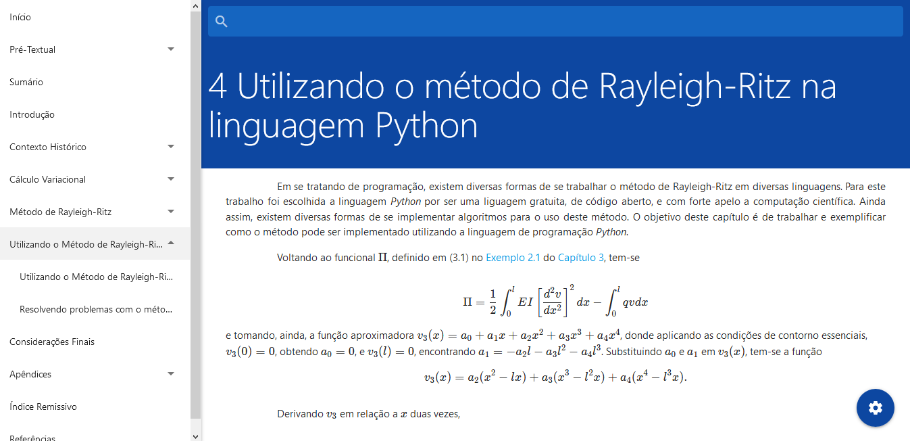

# Uma introdução ao cálculo variacional e ao método de Rayleigh-Ritz com aplicações em Python

## Sobre

Esse é o repositório utilizado para o controle de versão do código-fonte da escrita do meu trabalho de conclusão de curso em LaTeX. O trabalho tem título "**Uma introdução ao cálculo variacional e ao método de Rayleigh-Ritz com aplicações em Python**" e foi escrito sob orientação do professor mestre Tiago de Lima Bento Pereira ([Lattes](http://lattes.cnpq.br/0165990227853144)) no curso de Matemática, modalidade Licenciatura, na Universidade Estadual de Goiás ([CET](http://ccet.ueg.br/)).

Além do código-fonte do documento LaTeX do TCC, existem os programas (relativamente pequenos) escritos durante os estudos de desenvolvimento do trabalho. Esses programas estão escritos em **Python**. Em período posterior, cheguei a fazer um desses programas também na linguagem **R**. Esses programas não foram criados objetivando estarem dentro das melhores práticas para suas respectivas linguagens.

## Online

O trabalho foi escrito durante os dois semestres de 2019 e no começo de 2020, logo após a chegada da pandemia ao Brasil e o início da quarentena decidi criar uma versão online desse texto para treinar algumas coisas e poder relembrar meu trabalho. Essa versão pode ser vista [clicando aqui](https://eduardojm.github.io/tcc/).

O código-fonte do site acima, se encontra no *branch* **gh-pages** desse mesmo repositório. [Clique aqui](https://github.com/EduardoJM/tcc/tree/gh-pages) para acessar.

## Gnuplot

O trabalho utiliza o pacote **tkz-fct** para desenhar as funções em algumas das figuras e, provávelmente precisa do **gnuplot** para gerar, corretamente, as figuras. [Veja aqui](https://ctan.org/pkg/tkz-fct).

## Estrutura de Pastas

### Trabalho de conclusão de curso (LaTeX)

O trabalho de conclusão de curso, escrito em LaTeX, está colocado na pasta `src/trabalho` e tem algumas divisões:

- `src/trabalho/figuras` contém as figuras utilizadas no trabalho, nos relatórios e/ou nas apresentações. Existem algumas figuras que estão colocadas nessa pasta em formato `.tex` e que são incluidas dentro do ambiente picture utilizando o comando `\input{}` por serem desenhos feitos utilizando os pacotes **tikz**.

- `src/trabalho/latex` contém o documento principal, isto é, o trabalho de conclusão de curso. Na pasta `arquivos` dentro dessa mesma pasta, contém a ficha catalográfica e a folha de aprovação.

- `src/trabalho/presentation` contém a apresentação do trabalho de conclusão de curso.

- `src/trabalho/TC 1/relatorio` contém o relatório de trabalho de curso 1 entregue no primeiro semestre.

- `src/trabalho/TC 1/apresentação` contém a apresentação de resultados parciais realizada no primeiro semestre.

- `src/trabalho/references.bib` é o arquivo `.bib` contendo todas as referências utilizadas no trabalho de conclusão de curso, nos relatórios e etc.

### Programas (Python e R)

Os programas, escritos em Python ou em R, estão colocados em pastas divididas da seguinte forma:

- `src/programas/python/Sistema Linear/sistema_linear.py` é um pequeno programa para resolver sistemas lineares utilizando a biblioteca **sympy**.

- `src/programas/python/MRR/solve_mrr_exemplo.py` utiliza a biblioteca **sympy** para resolver um problema utilizando o método de Rayleigh-Ritz de forma simbólica.

- `src/programas/python/MRR/triangulate.py` resolve um problema utilizando o método de Rayleigh-Ritz de forma numérica.

- `src/programas/r/triangulate.R` é o mesmo `triangulate.py` implementado em R (com diversas diferenças).
